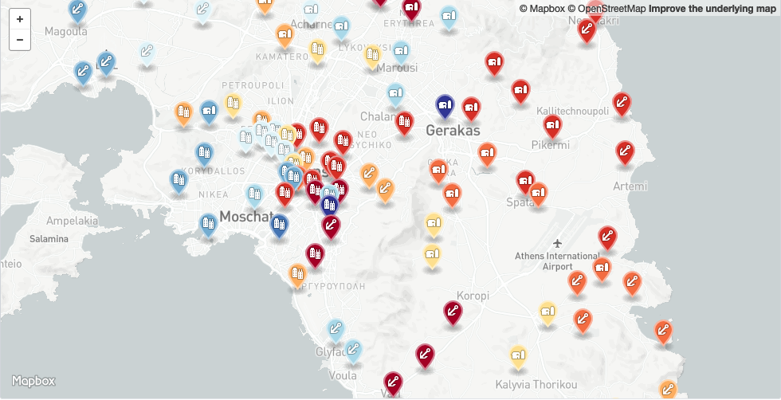

# Attic Demes Data

Basic data on Attic Demes in TSV and GeoJSON, extracted from Traill (1975) and Whitehead (2014).

For governmental purposes Ancient Attica (Athens and the surounding area) was divided after 508 BCE into 10 "tribes" (φυλαί), 3 "thirds" (τριττύες) and 149 "demes" (δῆμοι). Each deme was assigned to one of the three thirds (city, coast, or inland) and one of the tribes. The assignments were made so that every tribe countained city, coastal, and inland demes. When juries were selected, for instance, 50 citizens were selected by lot from each tribe (for a total of 500 jurors) and the jury could be expected to contain a good mix of demes and _trittyes_.

Men's names were recorded in official inscriptions with patronymic (father's name) and a demotic (deme name). For instance, the Athenian general Thrasybulus would be recorded as Θρασύβουλος Λύκου Στειριεύς _Thrasúboulos Lúkou Steirieús_, "Thrasybulus son of Lykos of Steiria." Women were excluded from full citizenship in Athens and when women appear in inscriptions they are not named in this way.

## Files

- [tribes-data.tsv](https://github.com/seanredmond/attic-demes/blob/master/tribes-data.tsv): Names of tribes in tab-delimited format
- [demes-data.tsv](https://github.com/seanredmond/attic-demes/blob/master/deme-data.tsv): Data on demes in tab-delimited format
- [deme-data.geojson](https://github.com/seanredmond/attic-demes/blob/master/deme-data.geojson): Data on locatable demes in geojson format. Github renders this as a nice map (pictured above)

### demes-data.tsv

Tab-delimited basic data about the demes. The fields in the file are

Name            | Description
----------------| -------------
Name            | Deme name in Greek
Transliteration | A consistent transliteration of the Greek
Anglicized      | Anglicized version of the deme name. Essesntially whatever is found in Traill (1975)
Tribe           | Number of the tribe to which the deme belonged. Numbers are traditional. For names see `tribe-data.tsv`
Trittys         | The _trittys_ to which the deme belonged. One of three values: `city`, `coast`, or `inland`
Bouleutaí       | Number of councillors (_bouleutaí_) alloted to the deme. The number is estimated for the end of the 4th Century BCE, "but it is generally held that they had remained unchanged since being originally fixed by Kleisthenes" (Whitehead, D. [2014] 369). The numbers are from Whitehead (2014) 369-373, based on Traill (1975) "his own addenda in some instances." The number does not quite add up to 500 due to gaps in the record. Some demes had a variable number of _bouleutaí_ in different years, alternating between 6 and and 7, which is recorded as 6.5
Gomme           | The number of known Athenians bearing a particular demotic included Traill (1975) from Gomme (1933). Where demes were later split into "upper" and "lower" demes, this count is divided over the two parts
Traill No.      | Number assigned to the deme in the table in Traill (1975)
Pleiades ID     | ID number of the deme in [Pleiades](https://pleiades.stoa.org/) (Bagnall, 2020)
Lat             | Latitude of the deme from Pleiades (or Wikipedia where this seemed incorrect) if known
Lon             | Longitude of the deme from Pleiades (or Wikipedia where this seemed incorrect) if known

It's difficult to attach any meaning to Gomme's counts of known people from each deme--how much is only due to accidents of history?--but it is interesting to look at at which demes are "over-" or "underrepresented" if we take the number of _bouleutaí_ as representing population. By far, more people are known from Akharnaí than anywhere else (452), but Akharnaí is also the 4th most _underrepresented_. With the most _bouleutaí_ (22), Akharnaí accounted for 4.42% of the Council, but only 3.75% of the known people, a difference of -0.67%. Oîon Kerameikón is the most overrepresented (0.20% of the Council,	1.16% of the known people, +0.96%)

### demes-data.geojson

Data extracted from `demes-data.tsv` and reformatted as GeoJSON. Demes that have not been located are excluded. Github turns this into a [nice map](https://github.com/seanredmond/attic-demes/blob/master/deme-data.geojson). Includes fields from `tribes-data.tsv` as well

### tribes-data.tsv

Names and tradition numbers of the Kleisthenic tribes. The fields are:

Name            | Description
----------------| -------------
Number          | Traditional number of the tribe
Name            | Tribe name in Greek
Transliteration | A consistent transliteration of the Greek
Anglicized      | Anglicized version of the tribe name. Essesntially whatever is found in Traill (1975)

## Sources

Gomme, A. W. (1933). _The Population of Athens in the Fifth and Fourth Centuries B.C._ Oxford: Blackwell, 1933.

Traill, J. (1975). _The Political Organization of Attica: A Study of the Demes, Trittyes, and Phylai, and Their Representation in the Athenian Council_. Hesperia Supplements, 14. Princeton: American School of Classical Studies at Athens. doi:10.2307/1353928

Whitehead, D. (2014). _The Demes of Attica, 508/7 -ca. 250 B.C.: A Political and Social Study_. (Course Book ed.). Princeton: Princeton University Press. muse.jhu.edu/book/35131.

Roger Bagnall, et al., eds. (2020). _Pleiades: A Gazetteer of Past Places_, http://pleiades.stoa.org/
